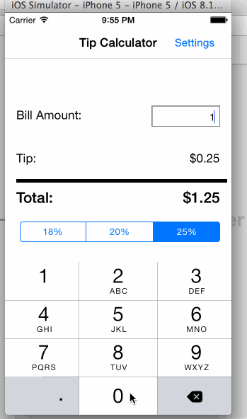

First assignment: tip calculator

Time spent: 2 hours.
* Required: User can enter a bill amount, choose tip percentage, and view total tip amount.
* Required: Settings page to store and change default tip amount.

GIF created with [LiceCap](http://www.cockos.com/licecap/).

